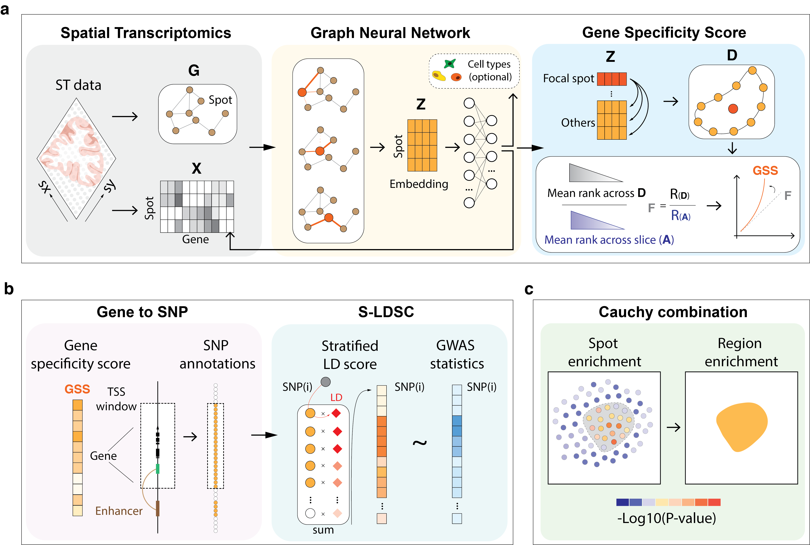

# gsMap: Genetically Informed Spatial Mapping of Cells for Complex Traits

[](https://github.com/LeonSong1995/gsMap/stargazers)
[](https://pypi.org/project/gsMap)
[](https://opensource.org/licenses/MIT)

---



## Table of Contents

- [Citation](#citation)
- [Installation](#installation)
- [Usage](#usage)
- [Online Visualization](#online-visualization)

## Citation

**Liyang Song, Wenhao Chen, Junren Hou, Minmin Guo, Jian Yang (2024).**  
*Spatially Resolved Mapping of Cells Associated with Human Complex Traits.*  
*(Under review)*

## Installation

Install using pip:

```bash
pip install gsMap
```

Install from source:

```bash
git clone https://github.com/LeonSong1995/gsMap.git
cd gsMap
pip install -e .
```

## Usage

Please check out the documentation and tutorials at [gsMap Documentation](https://yanglab.westlake.edu.cn/gsmap/document).

## Online Visualization

To visualize the traits-embryo or traits-brain association spatial maps, please refer to [gsMap Visualization](https://yanglab.westlake.edu.cn/gsmap/visualize).

---